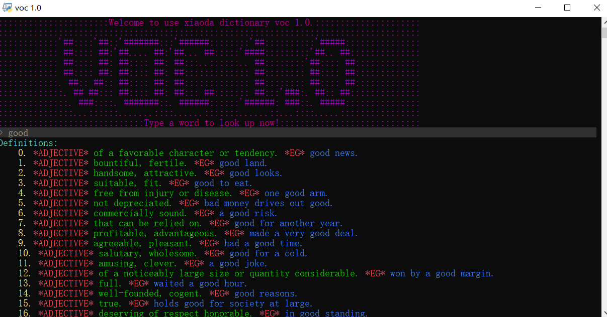

# Current Functionality

- Interactive python prompt using [python-prompt-toolkit](https://github.com/prompt-toolkit/python-prompt-toolkit).

- Look up words using [Merriam-Webster API](https://dictionaryapi.com/products/index).

- Sound playing using [playsound.py](https://github.com/TaylorSMarks/playsound).

- Spell check using [pyspellchecker](https://github.com/barrust/pyspellchecker).

  

# Future Functionality

- Word list function.